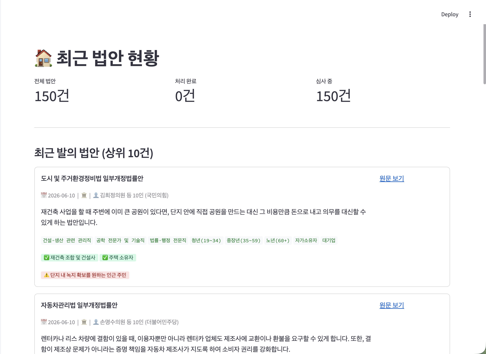
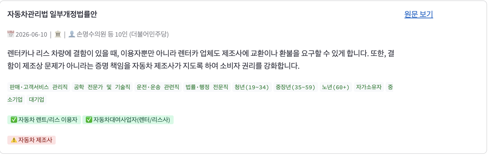
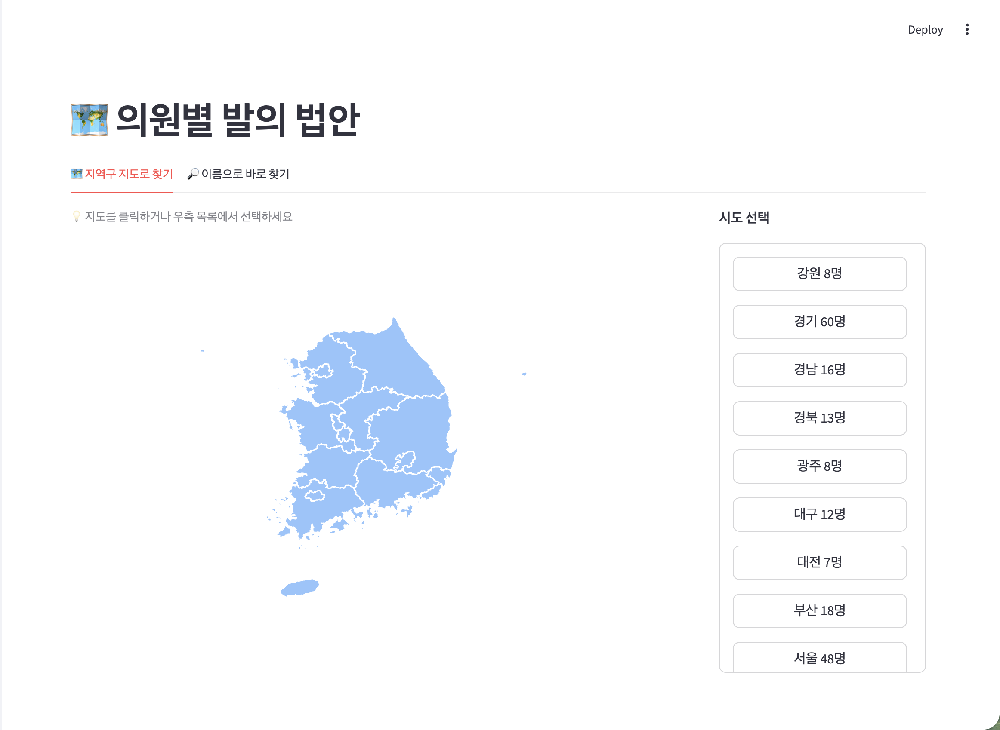
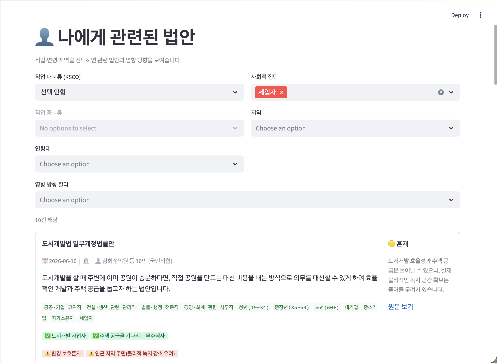
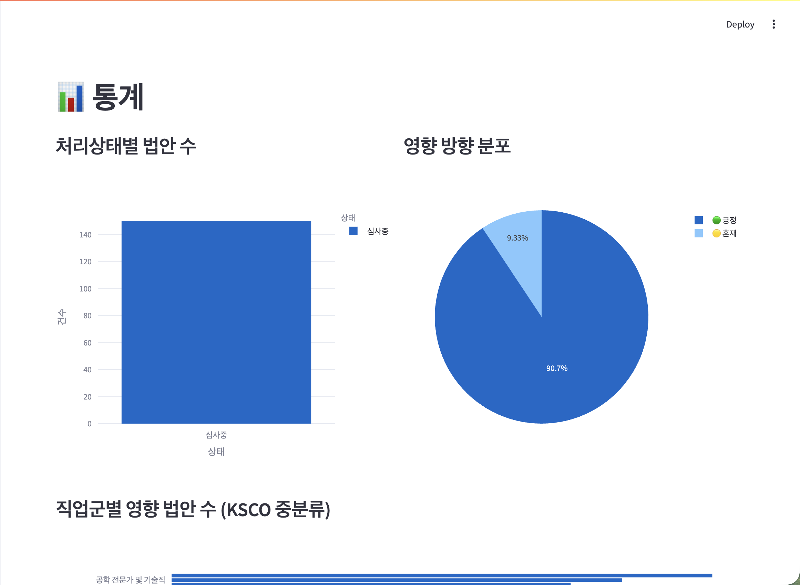

# 🏛️ 국회 법안 모니터링 시스템

> 대한민국 국회 법안을 자동 수집·분석하고, 시민이 자신의 삶과 연관된 법안을 쉽게 탐색할 수 있는 파이프라인 + 웹 서비스



---

## 주요 기능

### 📋 법안 카드 — LLM 분석 결과 시각화
각 법안에 대해 로컬 LLM이 분석한 내용을 직관적인 카드 형태로 제공합니다.
- 시민 친화적 요약 (법률 용어 없이)
- 영향받는 직업군·연령대·사회집단 태그
- 이해관계 충돌 집단 구분 (✅ 혜택 집단 / ⚠️ 불이익 집단)



### 🗺️ 지역구 지도로 의원 탐색
전국 choropleth 지도에서 시도를 클릭하거나 우측 버튼으로 선택하면 해당 지역 의원 목록과 발의 법안을 조회할 수 있습니다.



### 👤 나에게 관련된 법안
직업(KSCO 분류), 연령대, 사회적 집단, 지역을 선택하면 관련 법안과 영향 방향을 필터링해 보여줍니다.



### 📊 통계 대시보드
처리상태별·영향방향별·직업군별 법안 분포를 시각화합니다.



---

## 시스템 아키텍처

```
[열린국회정보 API]
       │
       ▼  collect.py  (매시간 정각)
[SQLite DB: bills + members]
       │
       ▼  analyze.py  (매시간 30분)
[bill_analysis: LLM 구조화 출력]
       │
       ▼  export.py   (매일 새벽 3시)
[GitHub data branch: bills.csv / members.csv]
       │
       ▼
[Streamlit 웹앱]
```

전 단계가 cron으로 자동화되어 있어 사람 개입 없이 수집 → 분석 → 배포가 운영됩니다.

---

## 기술 스택

| 레이어 | 기술 |
|---|---|
| 데이터 수집 | Python, 열린국회정보 OpenAPI |
| 저장소 | SQLite, GitHub Pages (data branch) |
| LLM 분석 | Ollama + Gemma 4 (로컬 추론) |
| 웹 서비스 | Streamlit, Plotly |
| 자동화 | cron |
| 직업 분류 체계 | 통계청 KSCO 8차 개정 |

---

## 프로젝트 구조

```
26_law_system/
├── app/
│   └── main.py          # Streamlit 웹 애플리케이션
├── pipeline/
│   ├── collect.py       # 법안·의원 데이터 수집
│   ├── analyze.py       # LLM 분석 파이프라인
│   └── export.py        # CSV 변환 및 GitHub push
├── local_db/
│   └── bills.db         # SQLite 데이터베이스
├── docs/
│   └── screenshots/     # README 이미지
├── crontab_setup.sh     # cron 자동화 등록 스크립트
└── requirements.txt
```

---

## 실행 방법

### 환경 설정

```bash
git clone https://github.com/{your-repo}
cd 26_law_system
pip install -r requirements.txt

# Ollama 설치 후 Gemma 4 모델 다운로드
ollama pull gemma3:12b
```

### 파이프라인 실행

```bash
cd pipeline

# 1. 법안 수집
python collect.py --pages 5

# 2. LLM 분석
python analyze.py

# 3. GitHub 배포
python export.py
```

### 웹앱 실행

```bash
streamlit run app/main.py
```

### 자동화 등록

```bash
bash crontab_setup.sh
```

---

## LLM 분석 출력 예시

```json
{
  "bill_summary": "렌터카나 리스 차량에 결함이 있을 때, 이용자뿐만 아니라 렌터카 업체도 제조사에 교환이나 환불을 요구할 수 있게 합니다.",
  "core_change": "자동차 결함 시 렌터카 업체의 제조사 직접 청구권 신설",
  "impact_direction": "positive",
  "affected_occupations": ["운전·운송 관련직", "판매·고객서비스 관리직"],
  "affected_ages": ["청년(19~34)", "중장년(35~59)"],
  "benefited_groups": ["자동차 렌트/리스 이용자", "자동차대여사업자"],
  "harmed_groups": ["자동차 제조사"]
}
```

---

## 데이터 현황

| 항목 | 수치 |
|---|---|
| 수집 법안 | 150건 (증분 수집 중) |
| LLM 분석 완료 | 100건, 실패율 0% |
| 의원 데이터 | 300명 |
| LLM 추론 속도 | 약 60~90초/건 (Apple Silicon) |

---

## 기술적 도전

**API 데이터 품질 문제**: 열린국회정보 `POLY_NM`(정당) 필드가 상시 공백으로 반환됨 → `members.csv` 조인 + 정규식 이름 추출로 보완

**LLM 출력 정규화**: 초기 `benefited_groups`에 "부담이 늘어나는 선거관리위원회"처럼 수식절이 혼입 → 금지 패턴 명시·예시 대조로 명사구 출력 강제

**Choropleth UX**: 3단계 드릴다운 지도 → 안정성 문제로 지도 + 버튼 패널 + 스크롤 목록 2-패널 구조로 재설계

---

## 향후 개선 방향

- 첫 방문 온보딩 → 자동 맞춤 필터 적용
- `benefited_groups` / `harmed_groups`를 "나에게 관련된 법안" 매칭에 통합
- 관심 법안 알림 기능

---

*데이터 출처: [열린국회정보](https://open.assembly.go.kr) | 직업 분류: [통계청 KSCO 8차](https://kssc.kostat.go.kr)*
